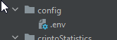
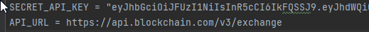
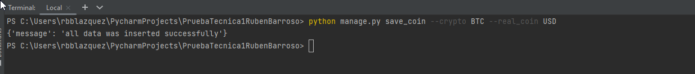
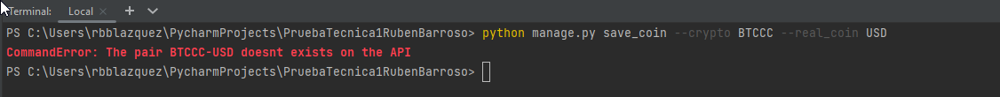
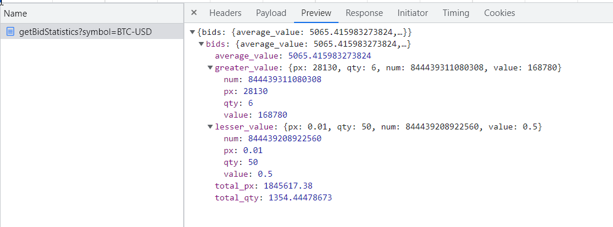
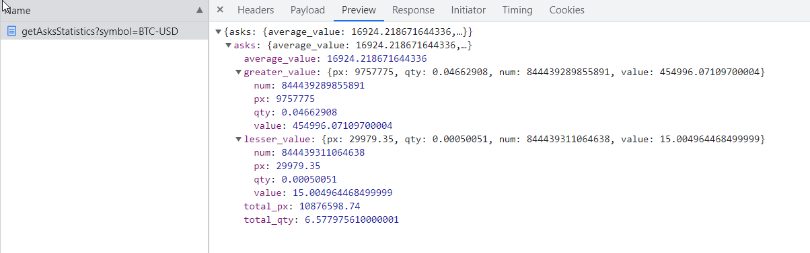
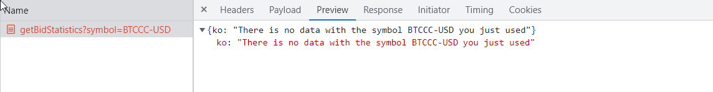
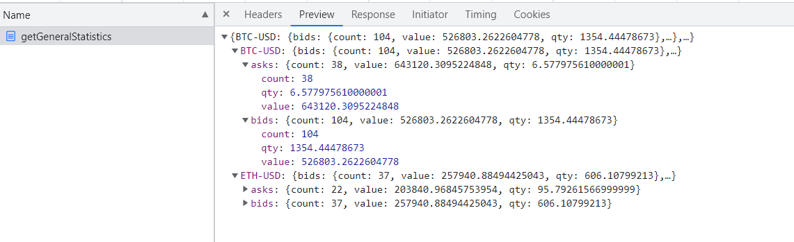

## API de estadísticas de criptomonedas (Con Django)

## Como ha sido realizado el programa
A la hora de crear la aplicación lo primero que he pensado es que base de datos utilizar, al ser un proyecto simple, he optado por usar el **sqlite** que trae django por defecto, por ello lo primero que he hecho ha sido crear las entidades de la base de datos, 
y en la aplicación **CryptoStatistics** he creado una carpeta **DBEntities**, que contiene las entidades necesarias. Por como devolvía el API la información, he supuesto que serían 3 entidades, la principal que sería **Symbol** y por otro lado **Bids** y **Asks** que tienen una relación de 1-Muchos,
ya que para 1 symbolo puede haber muchas ordenes de venta, y de compra. Un aspecto a destacar es que como desde un principio tenía la idea de generalizar la obtención de información de la base de datos, he hecho que dichas entidades extiendan de una interfaz que definen unos métodos comunes para posteriormente 
poder abstraer la parte de inserción de datos en un sitio común, para no tener dicha lógica por varios sitios de la aplicación.

Una vez creadas las entidades, lo segundo ha sido el crear el servicio que llevara a cabo toda las acciones de la base de datos de manera generalizada, es decir, 
que no estuviera atado a un tipo de entidad concreto, este servicio puede encontrarse en **ApplicationCore/Services/DB/DBManager**. Una vez creado dicho servicio, he creado los tests pertinentes para comprobar que funcionaba correctamente el servicio de BD.

Ya probado que tenemos la base de datos funcionando, se empezó con el primer ejercicio de la prueba, que era crear un comando para insertar datos en la base de datos, dado un símbolo y una moneda real, se tenía que obtener la información del API proporcionado mediante dichos datos.
Al ser un API que necesita credenciales he visto pertinente que hay que crear una configuración **.env**, para que nuestras claves de acceso estén seguras, ya que no debería estar dicha información incrustada en el código.
Una vez creado el .env y accedido a dichas variables en el ''Comando'' , la siguiente cuestión era como vamos a acceder al API, al igual que la base de datos, extraí la responsabilidad de hacer las llamadas al API a un servicio externo, el cual se encargara de proporcionar la lógica para llevar a cabo estás funciones, este servicio se encuentra en **"ApplicationCore/Services/API/ApiService"**. Ahora ya con la configuración .env, el servicio APi, 
y el servicio montado de BD mencionado anteriormente, podemos acabar el primer ejercicio, obtenido los datos de ordenes de compra y venta del API, e insertándolo en la base de datos (llevando acabo las pertinentes comprobaciones de posibles errores, definidos en los tests y en el código del comando)

Para los 3 siguientes ejercicios, se ha creado un clase en el fichero **models.py** de la aplicación **cryptoStatistics** , 
que contiene toda la lógica de obtención de estadísticas de las compras y ventas, para la resolución de dichas funciones se ha usado pandas, para tratar los datos que vienen de la base de datos y 
posteriormente obtener las medias, sumas, conteos necesarios.

Por último para poder acceder a la información mediante las urls, se han creado en el fichero **views.py** de la aplicación de **criptoStatistics** métodos que lo único que hacen es obtiener la información del modelo explicado recientemente,
y devolvérsela al usuario mediante una respuesta en formato json (como dice el ejercicio que hay que hacer), destacar que para que funcionen dichos métodos debemos asociar los métodos creados a una url, para ello se utiliza el fichero **urls.py** que se encuentra en el directorio **applicationCore**

## Instalación

### Dependencias Python
para instalar las dependencias necesarias, deberemos ir a la raiz del proyecto en la terminal, y lanzamos el siguiente comando
* `pip install -r requirements.txt`

### Base de datos
- ` python manage.py makemigrations CryptoStatistics ` este comando lo que hará sera dejar preparada la migración de la base de datos, es decir, todas las relaciones/tablas necesarias en la aplicación

- ` python manage.py migrate` con este comando aplicaremos lo que hemos dejado preparado en el comando anterior

- ` python manage.py sqlmigrate CryptoStatistics 0001  ` (este comando es opcional) se utiliza si quiere obtener las acciones que ha usado el comando anterior y obtener la información de las consultas SQL utilizadas

### Variables de Configuración
Debido a que vamos a tratar con un **API**, debemos guardar las variables como la **API-KEY** y la **URL de la API** en un lugar seguro, por ello lo que debemos hacer es irnos a la carpeta **config** del proyecto y editar el **.env**

en este fichero deberemos guardar nuestra **API-KEY** la cual es única, para obtenerla podemos ir a https://api.blockchain.com/v3/ donde tenemos la documentación de como podrías obtener la tuya 

### tests
Para comprobar que todo funciona correctamente, antes de utilizar el programa usaremos el siguiente comando:

* `python manage.py test CryptoStatistics`
Con estos tests nos aseguraremos de que tenemos correctamente la configuración del .env, y que de hemos hecho el migrate correctamente, ya que probará la inserción y obtención de nuestra base de datos

## ¿Cómo utilizar el programa? 

### Inserción de datos en nuestra BD
Para utilizar el programa lo primero que tendremos que hacer es ejecutar el siguiente comando en la terminal del proyecto o desde aquí, el cual inicia el programa
- `python manage.py runserver`

Una vez lanzado, lo primero que tendremos que hacer es insertar datos en la base de datos, para ello lo que haremos será lanzar el siguiente comando en la terminal, a este comando hay que pasarle el símbolo de una criptomoneda y la moneda real, por ejemplo:
- `simbolo: BTC, moneda: USD`
- `simbolo: BTC, moneda: EUR`
- `simbolo: ETH, moneda: USD`

para más información sobre los estos pares, puedes visitar https://www.blockchain.com/explorer , que es la página de la cual hemos obtenido el API-KEY.

Ahora con el simbolo y la moneda explicado, podríamos lanzar el siguiente comando

- `python manage.py save_coin --symbol BTC --real_coin USD`

Si el simbolo y la moneda real existe, nos devolverá un mensaje satisfactorio, que significará que ya tienes los datos guardados en la base de datos

en el caso en el que le pasemos un simbolo o moneda que no existe o no se ha podido encontrar en el API proporcionada, nos devolverá un mensaje con el problema encontrado
- `python manage.py save_coin --symbol BTCCC --real_coin USD`

### Obtención de estadísticas

Para la obtención de estadísticas se han creando 3 endpoints , a los cuales se puede acceder mediante la web proporcionada por el programa

- **/getBidStatistics** , devuelve las estadísticas de las órdenes de compra **(bids)** a esta funcionalidad se le puede pasar un parámetro symbol para que te devuelva las ordenes de venta de diferentes pares, por ejemplo http://127.0.0.1:8000/getBidStatistics?symbol=BTC-USD

- **/getAsksStatistics** , devuelve las estadísticas de las órdenes de venta **(asks)** , al igual que el primera, a esta se le puede pasar el mismo parámetro y obtener las ordenes de venta de una en particular http://127.0.0.1:8000/getAsksStatistics?symbol=BTC-USD

en caso de no haber datos de la criptomoneda pasada, devolverá el siguiente mensaje

- **/getGeneralStatistics** , devuelve las estadísticas generales de las órdenes de compra y de venta de todas las monedas guardadas en la base de datos http://127.0.0.1:8000/getGeneralStatistics

## Posibles Mejoras
- Abstraer más el servicio de base de datos, ya que ahora mismo está un poco obligado a que tenga que venir un tipo de estructura json definida con el nombre de la entidad
- Cambiar Base de datos a mongo db
- Interfaz de usuario